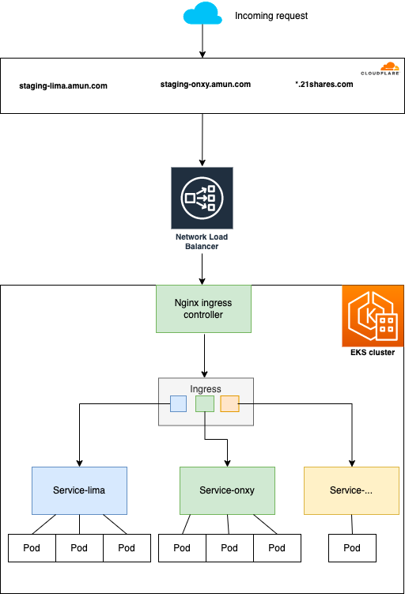

# TechDemo2Jun2022


Goal : Be able to understand/install ingress on existing eks cluster.

nginx!= nginx ingress cluster  
Kubernetes ingress != Ingress controllers




[Comparison Kubernetes Ingress Controllers](https://docs.google.com/spreadsheets/d/191WWNpjJ2za6-nbG4ZoUMXMpUK8KlCIosvQB0f-oq3k/edit#gid=907731238)


# [Ingress nginx](https://kubernetes.github.io/ingress-nginx/deploy/)

- [ ] Check Install ingress nginx helm repo
    ```bash
    $ helm ls -A
    ```
- [ ] Check the kubernetes services creation
    ```bash
    $ k get svc -A
    ```  
- [ ] Check the kubernetes services creation
    ```bash
    $ kubectl get pods -n ingress-nginx
    ```  

- [ ] Create a new ingress
    ```bash
    $ kubectl get pods -n ingress-nginx
    ```  

- [ ] Create namespace techdemo
    ```bash
    $ kubectl create namespace techdemo
    ```  

- [ ] Create namespace techdemo
    ```bash
    $ kubectl create namespace techdemo
    ```  

- [ ] Create apple pod and service in techdemo namespace
    ```bash
    $  kubectl apply -f apple/apple.yaml  
    ```      

- [ ] Create banana pod and service in techdemo namespace
    ```bash
    $kubectl apply -f banana/banana.yaml  
    ```    

- [ ] Create test.amun.com ingress with /banana and /apple
    ```bash
    $kubectl apply -f ingress/ingress.yaml
    ```       

- [ ] Create the pods and ingress is running
    ```bash
    $kubectl  get pods -n techdemo
    $kubectl  get ing  -n techdemo
    ```
 
- [ ] Go to cloudflare and create CNAME for the test.amun.com with the ac1353ae016b6486fbd98d10ffa15f3a-cb791fc66e816ab3.elb.us-west-2.amazonaws.com

# Delete
- [ ] Delete techdemo namespace 
    ```bash
    $kubectl delete namespace techdemo
    ```
- [ ] Delete cloudflare CNAME entry1


Links for the existing ingress 
